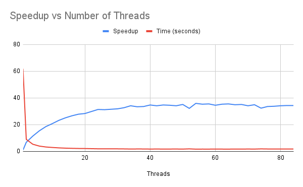
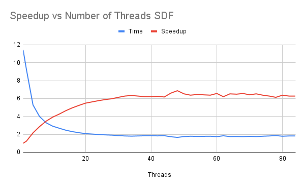

# Project 2: Threading and Multicore Applications

## Computing the Mean

### Performance Graph

### Question 1: Note the shape of the curve. Does it "converge" to some general value? What's the maximum speedup you got from threading? What happens when you use more cores than are available in the hardware?

The curve converges to over 35x speedup. My maximum speedup was around 35x when we hit 54 threads, then it started flattening out.
When using more cores than available in the hardware, the speedup stops improving and even slightly decreases from the overhead from thread
management.

### Question 2: Considering the number of cores in the system, do you get a linear scaling of performance as you add more cores?

No, I do not get a linear scaling of performance. The scaling is better than linear at first from the cache effects and memory
bandwidth improvements, but then levels off as more threads are being added to the program.

### Question 3: Looking at your graph, what value would you propose for p (the percentage of the program that is parallelized), and describe how you arrived at that value?

Looking at my graph, the speedup stop rising around 35-36x. Using Amdahl's Law where maximum speedup = 1/(1-p), I can solve
36 = 1/(1-p) which is around 0.97 or 97%. This means about 97% of the program is parallelized and 3% remains serial.

### Question 4: How many bytes of data are required per iteration? What's the associated bandwidth used by the kernel? Is that value consistent when you consider threaded versions?

Each iteration reads one float value which is 4 bytes. For a single-threaded version that is processing more than 8.5 billion floats in 61.85 seconds gives a bandwidth
of approximately 0.55GB/sec. In the threaded versions, the total data processed is the same, but the bandwidth increases with the speedup. For example with
8 threads completing in 3.33 second, the bandwidth is approximately 10.2GB/sec.

---

## Computing a Volume

### Performance Graph

### Question: Do you get similar performance curve to threaded.out?

The performance curve has a similar shape, it starts steep and then flattens out. However, the maximum speedup is much lower.
Part 1 achieved about 35-36x speedup whil part 2 only achieved about 7x speedup. This is because it spends more time generating
random numbers in each thread which isn't as efficient at  parallelizing the program.